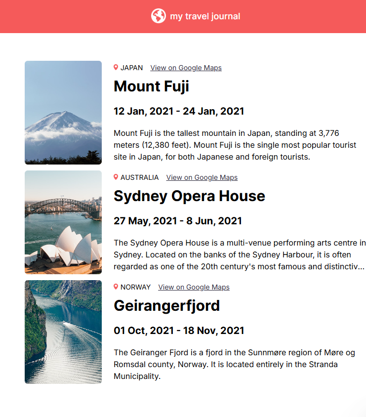

# 🧭 Travel Journal 

> A React-based travel journal showcasing destinations around the world through images, locations, and personal notes. 

---

## 🪞 Overview  
This Travel Journal web app allows users to explore different travel destinations through a clean and visually engaging interface. Built with React, it dynamically displays location details, dates, and personal descriptions for each trip. It’s perfect for travel enthusiasts who want inspiration or enjoy discovering places around the world. The project focuses on responsive design, smooth component structure, and reusable data-driven UI—making it both fun to use and educational for developers learning modern React practices.  

---

## 🚀 Features  

✨ Key things your app can do:  

- 🗺️ Displays travel destinations with images and location details  
- 🔗 Direct link to view each place on Google Maps  
- 📱 Fully responsive layout for all screen sizes  
- ⚛️ Data-driven components for clean and reusable code  

---

## 🧱 Tech Stack  

| Technology | Purpose |
|-----------|---------|
| **React.js** | Component-based UI development |
| **JavaScript (ES6+)** | App logic and dynamic rendering |
| **CSS3** | Styling and responsive layout |
| **Vite / Create React App** | Development and build tooling |

---

## 📚 What We Have Studied  

Here are the key JavaScript and React concepts learned while building this project 🧩  

- 🔁 Using `.map()` to dynamically generate components from data  
- 🧩 Props for passing data into components  
- 🧱 Component-based UI structure in React  
- 🖼️ Rendering images and external media using props  
- 📦 Importing and organizing assets & data files  
- 🌐 Opening external links with `target="_blank"`  
- 💅 Applying modular and responsive CSS to components  

---

## 🌿 Lessons Learned  
Reflect briefly on your takeaways:  

> - Learned how to structure a React project with reusable components  
> - Understood the importance of organizing data separately from UI  
> - Practiced passing props and dynamically rendering content  
> - Improved skills in styling layouts to be clean and responsive  
> - Gained confidence in working with images, links, and JSX  

---

## 🖼️ Screenshots / Demo  

  

🔗 **Live Demo:** (https://travel-journal-fawn-one.vercel.app/)  

---

## 💫 Author  
👩‍💻 **Created by [Aliya](https://github.com/aliyasyeddd)**  
> _“Build. Break. Learn. Repeat.”_ 🌸  

---

